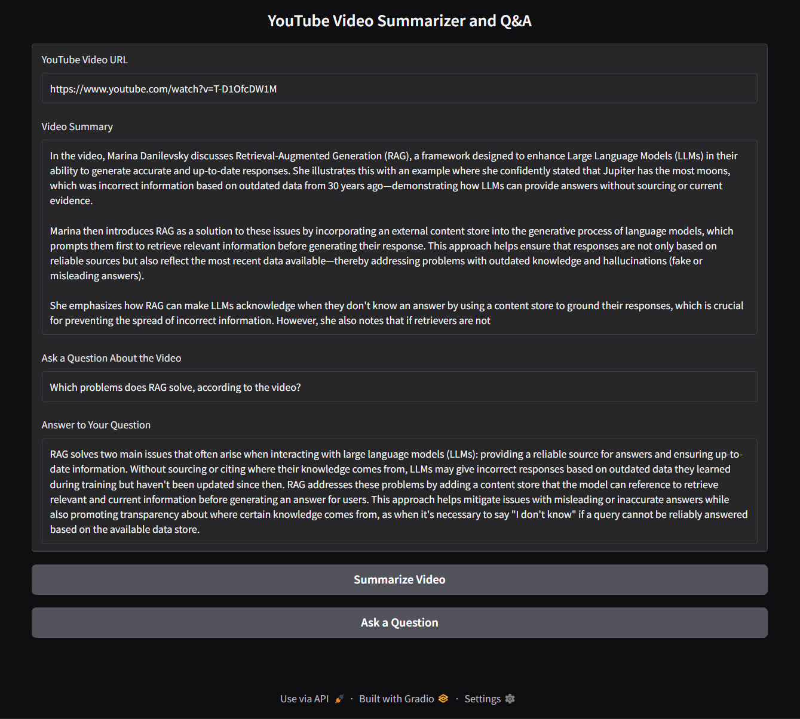

# yt-summarizer

Production-style RAG system for YouTube transcript summarization and question answering.

<p align="center">
  
</p>

## Features

- Fetches English transcripts from YouTube
- Summarizes the video content
- Supports question answering over the transcript
- Provides a local web interface with Gradio
- Exposes a FastAPI backend for programmatic access
- Uses centralized runtime configuration through `.env`
- Emits structured logs for pipeline steps, latency, warnings, and errors

## Libraries Used

- `gradio` for the web UI
- `fastapi` and `uvicorn` for the API backend
- `youtube-transcript-api` for retrieving video transcripts
- `langchain` for prompt and chain orchestration
- `langchain-ollama` for the LLM integration
- `langchain-huggingface` and `sentence-transformers` for embeddings
- `faiss-cpu` for vector search over transcript chunks

## Installation

Install dependencies:

```bash
uv sync
```

The default LLM backend uses Ollama with `phi3:mini`:

```bash
ollama pull phi3:mini
```

## Configuration

Create a local `.env` file from the example:

```bash
cp .env.example .env
```

Main runtime parameters:

```env
YT_LLM_MODEL=phi3:mini
YT_LLM_TEMPERATURE=0.5
YT_LLM_TIMEOUT_SECONDS=60
YT_LLM_RETRY_ATTEMPTS=2
YT_EMBEDDING_MODEL=sentence-transformers/all-MiniLM-L6-v2
YT_CHUNK_SIZE=1000
YT_CHUNK_OVERLAP=200
YT_RETRIEVAL_TOP_K=7
YT_LOG_LEVEL=INFO
YT_LOG_JSON=true
YT_API_PORT=8000
YT_GRADIO_PORT=7865
```

## Run the Gradio UI

```bash
uv run yt-summarizer-ui
```

The UI launches locally on port `7865` by default.

## Run the FastAPI Backend

```bash
uv run yt-summarizer-api
```

The API launches locally on port `8000`.

Useful URLs:

```text
http://localhost:8000/health
http://localhost:8000/docs
```

Example request:

```bash
curl -X POST http://localhost:8000/summarize \
  -H "Content-Type: application/json" \
  -d '{"video_url": "https://www.youtube.com/watch?v=VIDEO_ID"}'
```

## Alternative Local Entrypoint

```bash
uv run src/main.py
```
